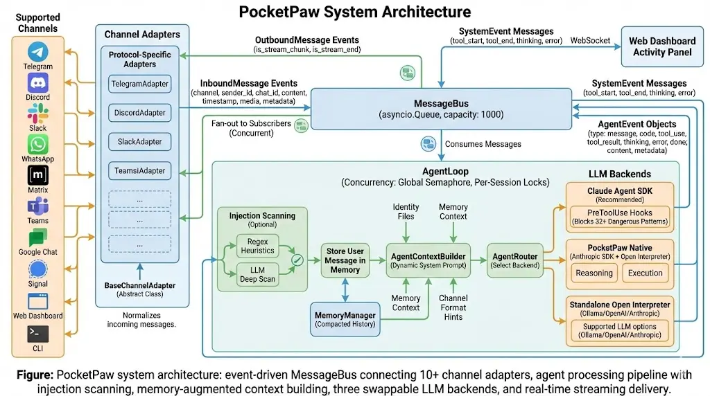
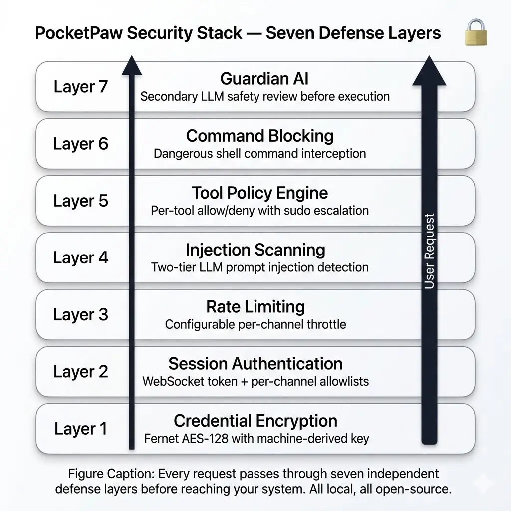
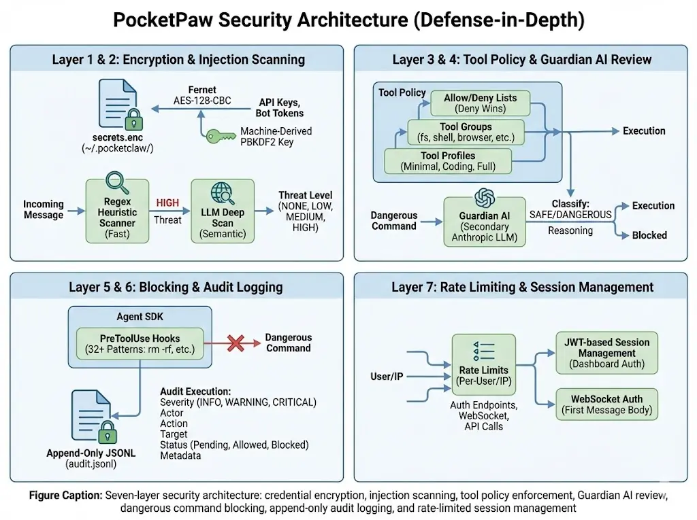

<p align="center">
  
</p>

<h1 align="center">🐾 PocketPaw</h1>

<p align="center">
  <strong>An AI agent that runs on your machine, not someone else's.</strong>
</p>

<p align="center">
  <a href="https://pypi.org/project/pocketpaw/"></a>
  <a href="https://opensource.org/licenses/MIT"></a>
  <a href="https://www.python.org/downloads/"></a>
  <a href="https://pypi.org/project/pocketpaw/"></a>
  <a href="https://github.com/pocketpaw/pocketpaw/stargazers"></a>
</p>

<p align="center">
  <a href="https://github.com/pocketpaw/pocketpaw/releases/latest/download/PocketPaw-Setup.exe"></a>
</p>

<p align="center">
  Self-hosted AI agent with a web dashboard. Talks to you over <strong>Discord</strong>, <strong>Slack</strong>, <strong>WhatsApp</strong>, <strong>Telegram</strong>, or the browser.<br>
  No subscription. No cloud lock-in. Your data stays on your machine.
</p>

> ⚠️ **Beta:** This project is under active development. Expect breaking changes between versions.

<p align="center">
  <video src="https://github.com/user-attachments/assets/a15bb8c7-6897-40d2-8111-aa905fe3fdfe" width="700" controls></video>
</p>

---

## Quick Start

### Via Desktop Installer

Sets up Python and PocketPaw in one click, then opens the dashboard.

| Platform | Download |
| --- | --- |
| **Windows** | [PocketPaw-Setup.exe](https://github.com/pocketpaw/pocketpaw/releases/latest/download/PocketPaw-Setup.exe) |

### Install via Terminal

<details open>
<summary>macOS / Linux</summary>

**Prerequisites:**
- Python 3.11 or higher ([download here](https://www.python.org/downloads/))
- pip package manager (included with Python)

**Quick install:**

```bash
pip install pocketpaw && pocketpaw
```

**Recommended install (with virtual environment):**

```bash
# 1. Verify Python version (must be 3.11+)
python3 --version

# 2. Upgrade pip to latest version
python3 -m pip install --upgrade pip

# 3. Create and activate virtual environment (optional but recommended)
python3 -m venv pocketpaw-env
source pocketpaw-env/bin/activate

# 4. Install PocketPaw
pip install pocketpaw

# 5. Run PocketPaw
pocketpaw
```

**Or use the automated install script:**

```bash
curl -fsSL https://pocketpaw.xyz/install.sh | sh
```

</details>

<details>
<summary>Windows (PowerShell)</summary>

**Prerequisites:**
- Python 3.11 or higher ([download here](https://www.python.org/downloads/))
- pip package manager (included with Python)
- Ensure Python is added to PATH during installation

**Automated installer:**

```powershell
powershell -NoExit -Command "iwr -useb https://pocketpaw.xyz/install.ps1 | iex"
```

**Manual install with pip:**

```powershell
# 1. Verify Python version (must be 3.11+)
python --version

# 2. Upgrade pip to latest version
python -m pip install --upgrade pip

# 3. Create and activate virtual environment (optional but recommended)
python -m venv pocketpaw-env
.\pocketpaw-env\Scripts\Activate.ps1

# 4. Install PocketPaw
pip install pocketpaw

# 5. Run PocketPaw
pocketpaw
```
---

    
> **Note:** Some features (browser automation, shell tools) work best under WSL2. Native Windows support covers the web dashboard and all LLM chat features.

</details>
## Windows CLI Troubleshooting

If you installed PocketPaw using:

```powershell
pip install pocketpaw
```

and the `pocketpaw` command is not recognized:

```text
'pocketpaw' is not recognized as an internal or external command
```

This usually means your Python Scripts directory is not added to PATH.

By default, it is located at:

```text
C:\Users\<your-username>\AppData\Local\Python\Python3.XX\Scripts
```

You can find your exact Scripts path by running:

```powershell
python -c "import sysconfig; print(sysconfig.get_path('scripts'))"
```

### How to Fix

1. Open Start → Search "Environment Variables"
2. Click "Edit the system environment variables"
3. Click "Environment Variables"
4. Under User variables → Select `Path` → Click Edit
5. Add the Scripts directory path
6. Restart your terminal

Alternatively, you can run PocketPaw using:

```powershell
python -m pocketpaw
```

<details>
<summary>Other methods</summary>

```bash
pipx install pocketpaw && pocketpaw    # Isolated install
uvx pocketpaw                           # Run without installing

# From source
git clone https://github.com/pocketpaw/pocketpaw.git
cd pocketpaw && uv run pocketpaw
```

</details>

<details>
<summary>Docker</summary>

```bash
git clone https://github.com/pocketpaw/pocketpaw.git && cd pocketpaw
cp .env.example .env
docker compose up -d
```

Dashboard at `http://localhost:8888`. Get the access token:

```bash
docker exec pocketpaw cat /home/pocketpaw/.pocketpaw/access_token
```

Agent-created files appear in `./workspace/` on the host. Optional profiles: `--profile ollama` (local LLMs), `--profile qdrant` (vector memory). Using Ollama on the host? Set `POCKETPAW_OLLAMA_HOST=http://host.docker.internal:11434` in `.env`.

</details>

The web dashboard opens at `http://localhost:8888`. From there you can connect Discord, Slack, WhatsApp, or Telegram.

---

## Features

| | |
| --- | --- |
| 📡 **9+ Channels** | Web Dashboard, Discord, Slack, WhatsApp, Telegram, Signal, Matrix, Teams, Google Chat |
| 🧠 **6 Agent Backends** | Claude Agent SDK, OpenAI Agents, Google ADK, Codex CLI, OpenCode, Copilot SDK |
| 🛠️ **50+ Tools** | Browser, web search, image gen, voice/TTS/STT, OCR, research, delegation, skills |
| 🔌 **Integrations** | Gmail, Calendar, Google Drive & Docs, Spotify, Reddit, MCP servers |
| 💾 **Memory** | Long-term facts, session history, smart compaction, Mem0 semantic search |
| 🔒 **Security** | Guardian AI, injection scanner, tool policy, plan mode, audit log, self-audit daemon |
| 🏠 **Local-First** | Runs on your machine. Ollama for fully offline operation. macOS / Windows / Linux. |

### Examples

```
You:  "Every Sunday evening, remind me which recycling bins to put out"
Paw:  Done. I'll check the recycling calendar and message you every Sunday at 6pm.

You:  "Find that memory leak, the app crashes after 2 hours"
Paw:  Found it. The WebSocket handler never closes connections. Here's the fix.

You:  "I need a competitor analysis report for our product launch"
Paw:  3 agents working on it. I'll ping you when it's ready.
```

---

## Architecture

<p align="center">
  
</p>

Everything goes through an event-driven message bus. Channels publish messages, the `AgentLoop` picks them up and routes to whichever backend you've configured. All six backends implement the same `AgentBackend` protocol, so swapping one for another doesn't touch the rest of the system.

### Agent Backends

| Backend | Key | Providers | MCP |
| --- | --- | --- | :---: |
| **Claude Agent SDK** (Default) | `claude_agent_sdk` | Anthropic, Ollama | Yes |
| **OpenAI Agents SDK** | `openai_agents` | OpenAI, Ollama | No |
| **Google ADK** | `google_adk` | Google (Gemini) | Yes |
| **Codex CLI** | `codex_cli` | OpenAI | Yes |
| **OpenCode** | `opencode` | External server | No |
| **Copilot SDK** | `copilot_sdk` | Copilot, OpenAI, Azure, Anthropic | No |

### Security

<p align="center">
  
</p>

A secondary LLM (Guardian AI) reviews every tool call before it runs. On top of that: injection scanning, configurable tool policies, plan mode for human approval, `--security-audit` CLI, a self-audit daemon, and an append-only audit log. [Details in the docs](https://pocketpaw.xyz/security).

<details>
<summary>Detailed security architecture</summary>
<br>
<p align="center">
  
</p>
</details>

---

## Configuration

Settings live in `~/.pocketpaw/config.json`. You can also use `POCKETPAW_`-prefixed env vars or the dashboard Settings panel. API keys are encrypted at rest.

```bash
export POCKETPAW_ANTHROPIC_API_KEY="sk-ant-..."   # Required for Claude SDK backend
export POCKETPAW_AGENT_BACKEND="claude_agent_sdk"  # or openai_agents, google_adk, etc.
```

> **Note:** An Anthropic API key from [console.anthropic.com](https://console.anthropic.com/api-keys) is required for the Claude SDK backend. OAuth tokens from Claude Free/Pro/Max plans are [not permitted](https://code.claude.com/docs/en/legal-and-compliance#authentication-and-credential-use) for third-party use. For free local inference, use Ollama instead.

See the [full configuration reference](https://pocketpaw.xyz/getting-started/configuration) for all settings.

---

## Development

**Prerequisites:**
- Python 3.11 or higher ([download here](https://www.python.org/downloads/))
- [uv](https://docs.astral.sh/uv/) package manager

**Install uv:**

```bash
# macOS/Linux
curl -LsSf https://astral.sh/uv/install.sh | sh

# Windows (PowerShell)
powershell -ExecutionPolicy ByPass -c "irm https://astral.sh/uv/install.ps1 | iex"

# Or via pip
pip install uv
```

**Setup and run:**

```bash
# 1. Verify Python version
python3 --version

# 2. Clone and enter the repository
git clone https://github.com/pocketpaw/pocketpaw.git && cd pocketpaw

# 3. Install with dev dependencies
uv sync --dev

# 4. Run PocketPaw in development mode (auto-reload)
uv run pocketpaw --dev

# 5. Run tests
uv run pytest               # Run tests (2000+)

# 6. Lint & format
uv run ruff check . && uv run ruff format .
```

<details>
<summary>Optional extras</summary>

```bash
pip install pocketpaw[openai-agents]       # OpenAI Agents backend
pip install pocketpaw[google-adk]          # Google ADK backend
pip install pocketpaw[discord]             # Discord
pip install pocketpaw[slack]               # Slack
pip install pocketpaw[memory]              # Mem0 semantic memory
pip install pocketpaw[all]                 # Everything
```

</details>

---

## Documentation

**[pocketpaw.xyz](https://pocketpaw.xyz)** covers getting started, backends, channels, tools, integrations, security, memory, and the full API reference.

---

## Star History

<a href="https://star-history.com/#pocketpaw/pocketpaw&Date">
 <picture>
   <source media="(prefers-color-scheme: dark)" srcset="https://api.star-history.com/svg?repos=pocketpaw/pocketpaw&type=Date&theme=dark" />
   <source media="(prefers-color-scheme: light)" srcset="https://api.star-history.com/svg?repos=pocketpaw/pocketpaw&type=Date" />
   
 </picture>
</a>

## Contributors

<a href="https://github.com/pocketpaw/pocketpaw/graphs/contributors">
  
</a>

---

## Join the Pack

- Twitter: [@prakashd88](https://twitter.com/prakashd88)
- Discord: [dsc.gg/pocketpaw](https://dsc.gg/pocketpaw)
- Email: pocketpawai@gmail.com

PRs welcome. Come build with us.

## License

MIT &copy; PocketPaw Team

<p align="center">
  
  <br>
  <strong>Built for people who'd rather own their AI than rent it</strong>
</p>
